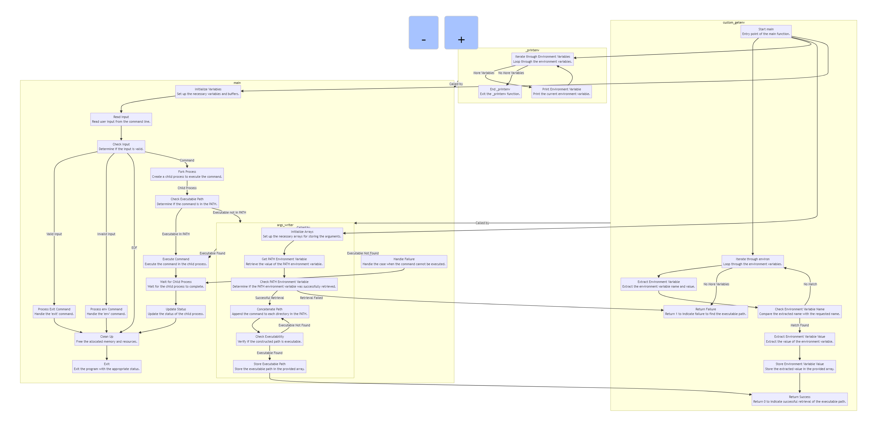

# C - Simple Shell Group Work 


## FILES


### [README.md](./README.md) 
* Info about Simple Shell Repository
### [AUTHORS](./AUTHORS) 
* Authors & Contributors of Simple Shell Repository
### [main.h](./main.h) 
* Headers and Prototypes of Simple Shell Programme 
### [shell.c](./shell.c) 
* Main Programme for Simple Shell
### [man_1_simple_shell](./man_1_simple_shell) 
* Manual page of Simple Shell


## Flowchart

<p align="center"></p>


## SHELL
This project is a mini shell implementation which is a command language interpreter that shall execute commands read from a command line string, the standard in both interactive mode and non-interactive mode.  It provides basic command-line interface functionalities such as executing commands, handling environment variables, and displaying environment variables. 

## ABOUT

The main function is responsible for the overall program flow, including reading user input, processing built-in commands (exit and env), forking child processes, and executing commands. It utilizes the custom_getenv and args_writer functions to handle environment variable retrieval and executable path resolution, respectively.

The custom_getenv function is responsible for retrieving the value of a custom environment variable. It iterates through the environ array, extracts the key-value pairs, and stores the extracted values in the provided args array.

The _printenv function simply prints the contents of the environment variables to the console.

The args_writer function is used to locate the executable for a given command. It retrieves the PATH environment variable, iterates through the directories in the PATH, and checks if the combined path is executable. If a valid executable is found, it stores the path in the provided arv array.

The flow diagram includes detailed explanations for each step, decision point, and function call, providing a comprehensive understanding of the code's logic and structure.

### Command Execution
* Executes commands entered by the user.

### Environment Variable Handling
* Provides functions to retrieve and print environment variables.

### Built-in Commands
* Includes built-in commands such as exit to terminate the shell and env to display environment variables.

## Features

### Dynamic Path Resolution
* One notable feature of the shell is its dynamic path resolution mechanism. When a command is entered without an absolute path, the shell searches through the directories listed in the PATH environment variable to find the executable file. This allows for seamless execution of commands without specifying their full paths.

### Error Handling
* The shell includes robust error handling mechanisms to gracefully handle various scenarios, such as command not found, memory allocation errors, and fork failures. Error messages are informative and help users understand the nature of the issue encountered.

### Clean Input Parsing
* Input parsing in the shell is handled efficiently and cleanly. User input is tokenized to separate commands and arguments, ensuring accurate execution and preventing common input-related errors.

### Process Management
* The shell effectively manages child processes spawned to execute commands. It utilizes the fork system call to create child processes, waits for their completion using the wait system call, and maintains proper handling of process statuses and exit codes.

### Compilation

Your code will be compiled this way:

```
$ gcc -Wall -Werror -Wextra -pedantic -std=gnu89 *.c -o hsh

```

### Usage

Your code will be run this way:

```
$ ./hsh

```


## Authors
*	Tahir Alizade - [Github]https://github.com/jamesbondie/